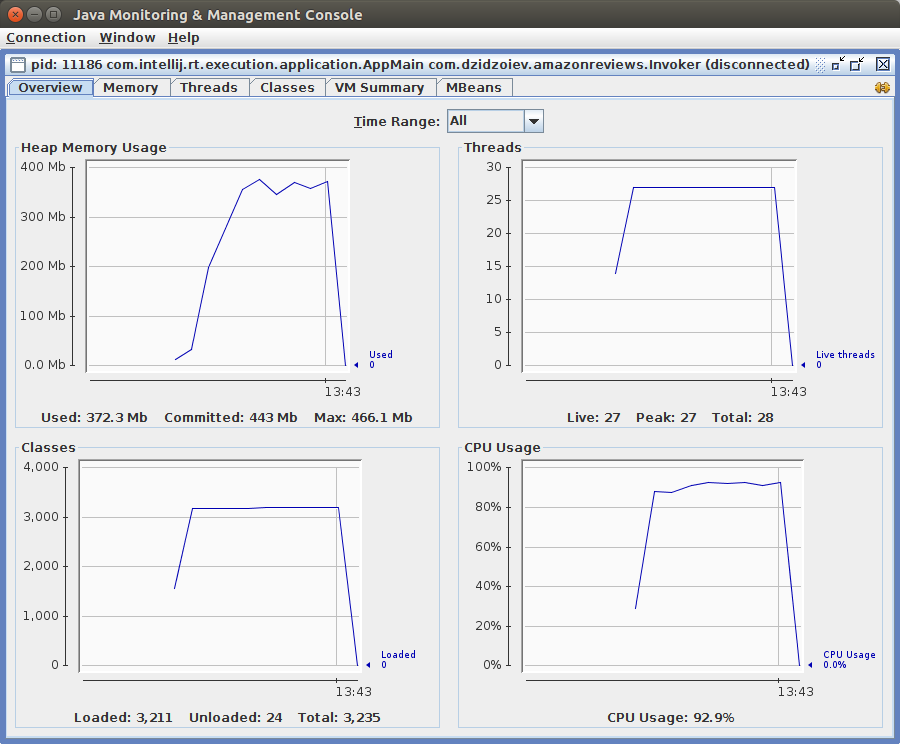

h1. Amazon food analyzer

h3. Task description
1) Finding 1000 most active users (profile names)
2) Finding 1000 most commented food items (item ids).
3) Finding 1000 most used words in the reviews
4) We want to translate all the reviews using Google Translate API. You can send up to 1000 characters per HTTP call. API has 200ms average response time. How to do it efficiently and cost effective (you pay for API calls and we have concurrency limits - 100 requests in parallel max) - please mock the calls to google translate API.

h3. How to build
1) Use `gradlew` ot `gradlew.bat` script to build project
See more at https://docs.gradle.org/current/userguide/gradle_wrapper.html.
2) Run application jar with main class `com.dzidzoiev.amazonreviews.Invoker`.
Arguments:
    1. String - Path to file.
    2. Integer - Number of items to process.
    3. Value `translate=true’ - Translate reviews (mocked)
    
h3. Memory consumption
Analyzed with jconsole
